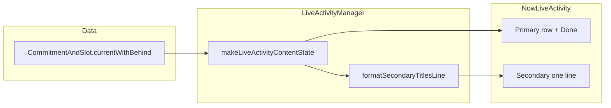

# Live Activity: primary + secondary current commitments

Hello **3Sauce** — this plan matches your four requirements against the current code in `[Shared/NowAttributes.swift](Shared/NowAttributes.swift)`, `[Wilgo/Features/Notifications/LiveActivityManager.swift](Wilgo/Features/Notifications/LiveActivityManager.swift)`, `[Now/NowLiveActivity.swift](Now/NowLiveActivity.swift)`, and `[Wilgo/Shared/Scheduling/CommitmentAndSlot.swift](Wilgo/Shared/Scheduling/CommitmentAndSlot.swift)`.

## Current behavior (baseline)

- **Source of truth for “who is current”**: `CommitmentAndSlot.currentWithBehind` returns a sorted array (`remainingFraction` on the first slot — sooner-to-end first).
- **Manager** (`[LiveActivityManager.swift](Wilgo/Features/Notifications/LiveActivityManager.swift)`): `makeLiveActivityUpdate` passes the full `current` array into `makeFirstLiveActivityContentState`, but that helper **only uses** `currentSlots.first` for title, slot text, and IDs. `staleDate` is the **primary** slot’s `endToday`.
- **LA visibility**: `apply` starts/updates only when `contentState?.hasCurrentCommitment == true`; otherwise it **ends all** activities immediately — already satisfies “empty list → no Live Activity.”
- **Sync when data changes**: `[StageView.swift](Wilgo/Features/Stage/StageView.swift)` calls `liveActivityManager.sync()` when `makeFirstLiveActivityContentState(from: viewModel.current)` **changes** (Hashable `ContentState`). Extending `ContentState` will automatically trigger sync when secondary titles or primary identity change while the app is active.

## Clarifications (assumptions stated explicitly)

1. **“Whole current commitment list”** means the same set and order as `CommitmentAndSlot.currentWithBehind` (the Stage “Current” list), not catch-up or upcoming.
2. **“When the top commitment changes … update and eventually end automatically”**:

- **Update**: Any change to who is primary, slot text, or the secondary title line should produce a new `ContentState` so `Activity.update` runs (and Stage’s `onChange` calls `sync()` when the app is foregrounded).
- **End**: Keep existing behavior — **end** when there is no current commitment (`contentState == nil`), and keep `**staleDate`* on the primary slot end so iOS can mark the activity stale after the window. No need to force `end`/`dismiss` when only the primary *identity swaps if another current commitment remains; `update` is the right API (same `NowAttributes`, new `ContentState`).

1. **“+n more” on one line**: Exact pixel fitting is not available without layout measurement in the widget; the robust approach is to **build one display string in the UI code** (or a small pure helper) with a **character budget** and `", "` separators, appending `"+n more"` when not all secondary titles fit. This matches “one line of space” in practice.

If you instead want **true** text measurement (UIFont/`Text` layout), say so — it is heavier and usually unnecessary for a Live Activity.

## Data model changes

**File:** `[Shared/NowAttributes.swift](Shared/NowAttributes.swift)`

- Add fields to `ContentState`, e.g.:
  - `secondaryTitlesLine: String` — **non-primary** titles only, single line, already truncated with `+n more`, or empty when `count <= 1`.
  - Alternatively `secondaryTitles: [String]` plus build the line in the widget for precise `+n more` without duplicating truncation logic in the extension.  
    !!!! I choose `secondaryTitles: [String]`, and let the LiveActivity UI code handles how to represent the data in the screen.
- Keep existing primary fields (`commitmentTitle`, `slotTimeText`, `commitmentId`, `slotId`) so `hasCurrentCommitment` and deep links stay stable; update comments to say “primary” where helpful.
- **ActivityKit payload size**: keep the secondary string bounded (e.g. cap number of titles considered and max length of each title contribution) to stay well under typical ActivityKit limits.

## Manager / formatting

**File:** `[LiveActivityManager.swift](Wilgo/Features/Notifications/LiveActivityManager.swift)`

- In `makeFirstLiveActivityContentState(from:)` (consider renaming to `makeLiveActivityContentState` in a **small follow-up commit** if you want clarity — optional):
  - Primary: unchanged — first element’s `commitment.title`, `slots[0].timeOfDayText`, encoded IDs (guard `slots.first` like today).
  - Secondaries: `Array(current.dropFirst()).map(\.commitment.title)` → pass through a **pure function** `formatSecondaryTitlesLine(titles:maxLength:)` (or similar) returning `secondaryTitlesLine`.
- `**staleDate` / `nextTransitionDate`: Keep `staleDate` tied to the **primary** slot end (first row). `nextTransitionDate` already uses `[CommitmentAndSlot.nextTransitionDate](Wilgo/Shared/Scheduling/CommitmentAndSlot.swift)` for boundary wakes. No change required unless you later observe missed reorder edge cases (unlikely for typical non-overlapping semantics).

## UI — Lock Screen + Dynamic Island (design v2)

**Goals:** modern hierarchy, concise copy, high signal — one glance shows _what now_, _when_, _what else_, and _done_.

**File:** `[Now/NowLiveActivity.swift](Now/NowLiveActivity.swift)`

- **Lock screen (`ActivityConfiguration` content)**
  - **Single card row:** Leading **sparkles** inside a small **tinted circle** (soft accent fill, not flat emoji-scale icon). Trailing **Done** is a **capsule** (green fill + checkmark) — same deep link `wilgo://done?commitmentId=` for the **primary** only; compact width, not a full-width bar.
  - **Primary copy:** `headline` title (1 line) + `caption` slot range with **medium** weight for slightly better legibility on lock screen blur.
  - **Secondary (only if `secondaryTitles` non-empty):** One line under the primary block, **leading-aligned with the text column** (not under the icon). Prefix with `list.bullet` (caption2, tertiary) so “more commitments” is scannable without repeating “Also:”. Body still uses `formatSecondaryTitlesLine` (ellipsis is a safety net).
- **Dynamic Island**
  - **Expanded leading:** Same circular icon treatment (scaled down) for brand continuity.
  - **Expanded center:** Title → time → optional secondary (same string as lock screen; list bullet + line).
  - **Expanded bottom:** Capsule **Done** only (primary action isolated; matches thumb reach).
  - **Compact leading:** Sparkles (caption).
  - **Compact trailing:** Primary title (1 line). If there are secondaries, a tiny `+N` capsule (count = `secondaryTitles.count`) so users see backlog depth without a second line.
  - **Minimal:** Sparkles only (unchanged — space is extremely tight).
- **Previews:** `ContentState.withCommitment` keeps sample secondaries for both lock screen and island previews.
- **Preconditions:** unchanged — `hasCurrentCommitment` in widget; manager never starts LA with an empty list.

## ASCII — Lock Screen + island (conceptual)

**Lock screen**

```
+----------------------------------------------------------+
|  (●)  Morning reading              [ Done ✓ ]           |
|       9:00 AM – 11:00 AM                                |
|       ▸ Walk dog, Email inbox +1                        |
+----------------------------------------------------------+
```

**Dynamic Island expanded**

```
 Leading   Center                          Bottom
 [●✦]      Morning reading               [ Done ✓ ]
           9:00 AM – 11:00 AM
           ▸ Walk dog, Email +1
```

If only one current commitment, omit the secondary line (and compact has no `+N` badge).

## Testing and commits (for implementation phase)

Per your preference: **small, self-contained commits** and **verify** before claiming done.

Suggested commit split:

1. **Model**: `ContentState` + `Hashable`/`Codable` + preview fixture updates (if previews compile in CI).
2. **Manager**: secondary line builder + `makeFirstLiveActivityContentState` wiring + unit tests on the **pure formatter** (new test file under `WilgoTests/`).
3. **Widget UI**: `NowLiveActivity` layout + Dynamic Island tweaks.

Verification:

- Build the **Now** extension + app targets in Xcode.
- Manual: multiple “current” commitments (if your test data allows), confirm one-line secondary and `+n more`.
- Manual: complete primary via deep link / empty list → LA dismisses.
- Optional: snapshot or preview-only check for layout regressions.


